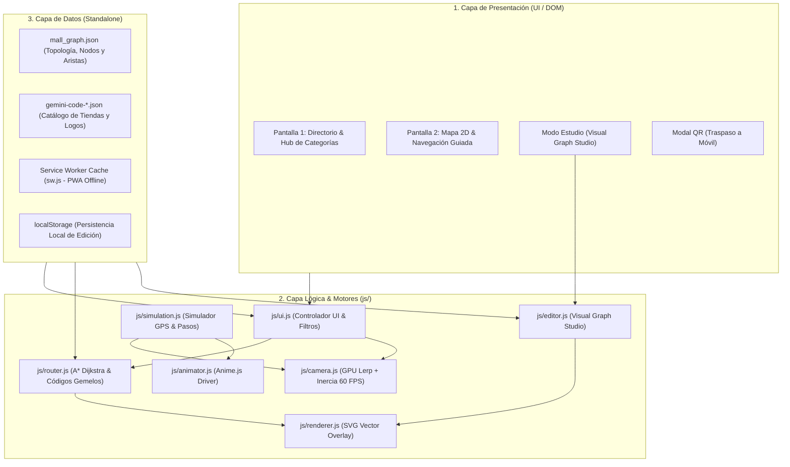

# 📍 Paseo Altozano · Sistema de Navegación A* y Directorio Digital

Sistema de señalética digital interactiva, directorio comercial inteligente y motor de navegación peatonal interior (*Indoor Navigation*) optimizado para **Tótems Kioscos de Centro Comercial** y **Smartphones (vía código QR)**.

Diseñado con una **arquitectura desacoplada, 100% standalone y *offline-first*** (cero dependencias de backend en tiempo de ejecución).

---

## 🌟 Características Principales

- **🧭 Motor de Navegación Dijkstra / A\* Multinivel:** Calcula la ruta peatonal óptima entre cualquier origen y destino cruzando Planta Baja (PB), Nivel 1 (N1) y Nivel 2 (N2).
- **🔗 Motor de Códigos Gemelos (`twin_code`):** Vinculación física estricta entre escaleras eléctricas y elevadores gemelos entre pisos, eliminando conjeturas o teletransportaciones.
- **🎥 Cámara Cinemática Acelerada por GPU (60 FPS):** Transformaciones espaciales en 2D (`translate3d` + `scale`) con bucle cinemático `requestAnimationFrame`, interpolación lineal (*Lerp*), inercia suave al soltar y soporte multitáctil (*pinch-to-zoom* / *drag*).
- **🏬 Directorio Comercial Dinámico:** Hub visual categorizado (Comida, Moda, Café, Entretenimiento, Servicios, etc.) con búsqueda predictiva en tiempo real y filtrado por nivel.
- **🎨 Logotipos Vectoriales Puros (HD Infinito):** Renderizado SVG sobre mapa arquitectónico con fondos sólidos de alto contraste y cero marcas de agua.
- **🛠️ Modo Estudio Integrado (*Visual Graph & Logo Studio*):** Panel HUD *drag-and-drop* para crear nodos, conectar pasillos, calibrar posiciones de logotipos y exportar el grafo maestro en JSON.
- **⚡ 100% Offline-First (PWA):** Service Worker con estrategia *Network-First* y precaché de planos, grafos y assets para operar de forma autónoma sin conexión a internet.

---

## 🏗️ Arquitectura del Sistema

El sistema implementa un patrón modular por capas en JavaScript Vanilla (ES6+):



---

## 📁 Estructura del Directorio y Módulos

```text
navegacion-paseo-altozano/
├── index.html                      # Vista principal (Tótem, Directorio, Mapa y Modales)
├── mall_graph.json                 # GRAFO MAESTRO: Topología de nodos, aristas y códigos gemelos
├── gemini-code-1787086839436.json  # METADATOS: Catálogo comercial de locales, categorías y logos
├── sw.js                           # Service Worker PWA (Estrategia Network-First con fallback offline)
├── README.md                       # Documentación técnica de arquitectura y desarrollo
│
├── js/                             # Módulos JavaScript (Vanilla JS ES6+)
│   ├── config.js                   # Constantes globales, dimensiones de planos, pisos y categorías
│   ├── state.js                    # Estado reactivo global (piso activo, selección, modo estudio)
│   ├── camera.js                   # Motor cinemático de cámara (GPU Lerp, inercia, drag y zoom)
│   ├── router.js                   # Motor de enrutamiento A* Dijkstra y validación de códigos gemelos
│   ├── renderer.js                 # Renderizador vectorial SVG (nodos, aristas, badges de marcas y ruta)
│   ├── animator.js                 # Controlador de animaciones fluidas (Anime.js)
│   ├── simulation.js               # Simulador de caminata GPS y HUD de cambio de piso
│   ├── editor.js                   # Visual Graph & Logo Studio (Edición visual de nodos y aristas)
│   ├── ui.js                       # Controlador de eventos UI, directorio, filtros y modal QR
│   └── app.js                      # Bootstrap de inicialización, preloader y orquestador
│
├── assets/
│   └── logos/                      # Catálogo de logotipos SVG vectoriales de marcas comerciales
│
└── Planos Arquitectónicos Calibrados:
    ├── planta-baja-dark.png        # PB (1536 x 727 px)
    ├── planta-uno-dark.png         # Nivel 1 (1536 x 718 px)
    └── planta-dos-dark.png         # Nivel 2 (1536 x 669 px)
```

---

## 🧩 Descripción Detallada de Módulos

| Archivo | Responsabilidad Principal | Funciones / Claves Críticas |
| :--- | :--- | :--- |
| [`index.html`](index.html) | Estructura HTML5, Tailwind CSS, SVG Overlay, Stage de Cámara y Contenedores HUD. | `#view-directory`, `#view-map`, `#map-camera-stage`, `#map-svg-overlay`. |
| [`mall_graph.json`](mall_graph.json) | Base de datos topológica de la plaza. Contiene nodos con `(x, y)`, `level`, `type` y `twin_code`. | `nodes`, `edges`, `twin_code`, `total_nodes`, `total_edges`. |
| [`gemini-code-*.json`](gemini-code-1787086839436.json) | Catálogo enriquecido de tiendas: nombres, categorías, logo a color y logo blanco. | `mall_legends`, `nivel_inferior`, `nivel_principal`, `nivel_superior`. |
| [`js/config.js`](js/config.js) | Configuración estática: `APP_CACHE_VERSION`, `TOTEM_NODE_ID`, `FLOOR_SPECS`, categorías. | `APP_CACHE_VERSION`, `FLOOR_SPECS`, `DIRECTORY_CATEGORIES`. |
| [`js/state.js`](js/state.js) | Gestor de estado en memoria del sistema de navegación. | `AltozanoState`, `currentLevel`, `routeSegments`, `currentCamera`. |
| [`js/camera.js`](js/camera.js) | Motor de física y cámara cinemática acelerada por GPU vía `style.transform`. | `setupInteractiveCameraPan()`, `cameraTick()`, `zoomToOverview()`. |
| [`js/router.js`](js/router.js) | Motor A* / Dijkstra multifloor y resolución dinámica de portales por código gemelo. | `calculateMultiFloorRoute()`, `getDynamicPortals()`, `aStarSingleFloor()`. |
| [`js/renderer.js`](js/renderer.js) | Dibuja sobre el SVG las capas de pasillos, ruta punteada activa, badges de marca y pines. | `renderMapOverlay()`, `positionNavArrowOnNode()`, `getLogoHtml()`. |
| [`js/animator.js`](js/animator.js) | Animaciones de ruta punteada, rotación de la flecha GPS y efectos de entrada. | `animateRoutePath()`, `animateArrowTo()`, `popInDestinationPin()`. |
| [`js/simulation.js`](js/simulation.js) | Simulador de caminata peatonal interactivo paso a paso con HUD de cambio de piso. | `toggleWalkSimulation()`, `playCurrentFloorSegment()`, `stopWalkSimulation()`. |
| [`js/editor.js`](js/editor.js) | Visual Graph & Logo Studio para calibrar y exportar el grafo maestro. | `toggleEditorMode()`, `handleSelectedNodeTwinCodeChange()`, `saveCustomGraphToStorage()`. |
| [`js/ui.js`](js/ui.js) | Lógica de interfaz: Hub de categorías, directorio de tarjetas, cambio de piso y modal QR. | `showMapView()`, `showDirectoryView()`, `renderCategoryHub()`, `filterByCategory()`. |
| [`js/app.js`](js/app.js) | Bootstrap de arranque, precarga en paralelo de imágenes/SVGs y control del preloader. | `initApp()`, `loadCachedJson()`, `preloadSingleImage()`. |
| [`sw.js`](sw.js) | Service Worker con estrategia *Network-First* y respaldo local sin conexión. | `CACHE_NAME`, eventos `fetch`, `install`, `activate`. |

---

## 🪜 Motor de Enrutamiento y Códigos Gemelos (`twin_code`)

Para conectar pisos diferentes sin errores de teletransportación, el algoritmo A* sigue una regla estricta:

1. **Emparejamiento Estricto:** `getDynamicPortals()` en [`js/router.js`](js/router.js) agrupa los nodos por su identificador `twin_code` (ej. `ESC-CHEDRAUI-TERRAZA`).
2. **Condición de Conexión:** Un portal vertical **solo se activa si y solo si existen al menos 2 nodos en pisos distintos compartiendo el mismo código exacto**.
3. **Aislamiento de Nodos Solitarios:** Si una escalera tiene un código como `ESC-SOLA` (que solo existe en un nivel), el enrutador **la ignora para cambios de nivel** y jamás la cruzará con otra escalera.
4. **Auto-Conexión Fail-Safe:** En `buildFloorSubgraphs()`, si un local comercial no tiene aristas asignadas en el JSON, el sistema lo enlaza automáticamente en tiempo de ejecución con el punto de pasillo más cercano, garantizando **100% de éxito en rutas**.

---

## 🎥 Motor de Cámara Cinemática (`camera.js`)

Se eliminó cualquier manipulación del atributo `viewBox` del SVG para evitar bloqueos del hilo principal:

- **GPU Acceleration:** Las transformaciones se aplican directamente al elemento DOM contenedor:
  ```javascript
  cameraStage.style.transform = `translate3d(${cam.x}px, ${cam.y}px, 0px) scale(${cam.zoom}) rotate(${cam.rotation}deg)`;
  ```
- **Cinematic Lerp:** El bucle cinemático en `requestAnimationFrame` interpola suavemente la posición actual hacia el objetivo:
  $$\text{pos} = \text{pos} + (\text{target} - \text{pos}) \times \text{LERP\_FACTOR}$$
- **Inercia Peatonal:** Al arrastrar y soltar el mapa, la cámara conserva la velocidad de arrastre con amortiguamiento exponencial.

---

## 🔌 Guía de Integración en Sistemas Existentes

### Opción A: Embebido en `<iframe>` o Webview (Recomendada)
Permite aislar estilos y scripts sin colisiones con el sistema anfitrión:
```html
<iframe 
  src="https://tu-servidor.com/navegacion-paseo-altozano/index.html" 
  width="100%" 
  height="100%" 
  frameborder="0"
  allow="geolocation">
</iframe>
```

### Opción B: Deep Linking vía Parámetros URL
El sistema analiza parámetros URL al inicializar para abrir destinos específicos directamente:
- **Trazar ruta a un local específico:** `index.html?dest=n_lvl1_store_1`
- **Abrir mapa general en Nivel 2:** `index.html?view=map&lvl=3`
- **Modo Móvil tras escaneo QR:** `index.html?dest=n_lvl2_store_5&mobile=true`

### Opción C: Consumo Modular como Librería JavaScript
Puedes importar directamente el motor de rutas en aplicaciones React, Vue o Node:
```javascript
import { calculateMultiFloorRoute } from './js/router.js';

// Calcular tramos de ruta entre Tótem (Punto 12) y Mammut Pizza (Nivel 2)
const route = calculateMultiFloorRoute('n_totem_12', 'n_lvl3_store_1');
console.log('Tramos calculados:', route);
```

---

## 🛠️ Guía de Mantenimiento y Edición Visual (Modo Estudio)

Para modificar pasillos, tiendas, sanitarios o escaleras:

1. **Activar el Modo Estudio:** Abre la aplicación en el navegador y pulsa el botón **"Mover Logos" / "Editar Grafo"** en la esquina superior derecha del mapa.
2. **Submodo Nodos y Aristas:**
   - **Mover:** Arrastra cualquier nodo para reposicionarlo en el plano.
   - **Crear:** Pulsa `+ Nodo`, `+ Baño`, `+ Ascensor`, `+ Escalera` o haz doble clic en el mapa.
   - **Enlazar Pasillos:** Pulsa `Enlazar`, toca el nodo origen y luego el nodo destino.
   - **Asignar Código Gemelo:** Selecciona una escalera o elevador y escribe/selecciona su identificador (ej. `ESC-CHEDRAUI-TERRAZA`).
3. **Submodo Posición de Logos:**
   - Arrastra el logotipo de la marca para desacoplarlo visualmente del punto de navegación y ajustarlo al local arquitectónico.
4. **Guardar y Exportar:**
   - Pulsa **"Guardar"** para almacenar los cambios en `localStorage`.
   - Pulsa **"Exportar JSON"** para descargar el archivo actualizado y reemplazar [`mall_graph.json`](mall_graph.json) en el repositorio.

---

## 🚀 Puesta en Marcha Local

Para ejecutar el proyecto en tu entorno local:

```bash
# 1. Clonar el repositorio
git clone https://github.com/BrayanRCS/navegacion-paseo-altozano.git

# 2. Entrar al directorio
cd navegacion-paseo-altozano

# 3. Iniciar un servidor HTTP local (ejemplo con Node.js http-server o Python)
npx http-server -p 8080 -c-1
# o con Python:
python -m http.server 8080

# 4. Abrir en el navegador
# http://localhost:8080/index.html
```

---

## 🧪 Pruebas Automatizadas de Integridad

El repositorio incluye suites de pruebas en Node.js para validar grafos, rutas y compatibilidad:

```bash
# Ejecutar verificación completa de runtime (26 pruebas unitarias y de integración)
node scratch/test_runtime.js

# Validar conectividad de rutas al 100% de los 138 locales comerciales
node scratch/test_all_portal_routes.js
```

---

**Paseo Altozano · Sistema de Navegación A\***  
*Desarrollado para tótems táctiles de alta definición y señalética digital de centros comerciales.*
